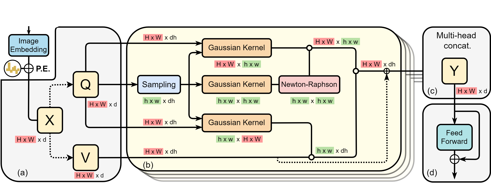

# SOFT: Softmax-free Transformer with Linear Complexity



> [**SOFT: Softmax-free Transformer with Linear Complexity**](https://arxiv.org/abs/xxx),            
> Jiachen Lu, Jinghan Yao, Junge Zhang, Xiatian Zhu, Hang Xu, Weiguo Gao, Chunjing Xu, Tao Xiang, Li Zhang,        
> *NeurIPS 2021 Spotlight* 


## Requirments
timm

torch>=1.7.0 and torchvision that matches the PyTorch installation

cuda>=10.2

### Data preparation

Download and extract ImageNet train and val images from http://image-net.org/.
The directory structure is the standard layout for the torchvision [`datasets.ImageFolder`](https://pytorch.org/docs/stable/torchvision/datasets.html#imagefolder), and the training and validation data is expected to be in the `train/` folder and `val` folder respectively:

```
/path/to/imagenet/
  train/
    class1/
      img1.jpeg
    class2/
      img2.jpeg
  val/
    class1/
      img3.jpeg
    class/2
      img4.jpeg
```
## Installation
```shell script
git clone https://github.com/fudan-zvg/SOFT.git
python -m pip install -e SOFT
```

## Main results
### Image Classification
#### ImageNet-1K

| Model       | Resolution | Params | FLOPs | Top-1 % | Config |
|-------------|:----------:|:------:|:-----:|:-------:|--------|
| SOFT-Tiny   | 224        | 13M    | 1.9G  | 79.3    |[SOFT_Tiny.yaml](config/SOFT_Tiny.yaml)|
| SOFT-Small  | 224        | 24M    | 3.3G  | 82.2    |[SOFT_Small.yaml](config/SOFT_Small.yaml)|
| SOFT-Medium | 224        | 45M    | 7.2G  | 82.9    |[SOFT_Meidum.yaml](config/SOFT_Medium.yaml)|
| SOFT-Large  | 224        | 64M    | 11.0G | 83.1    |[SOFT_Large.yaml](config/SOFT_Large.yaml)|
| SOFT-Huge   | 224        | 87M    | 16.3G | 83.3    |[SOFT_Huge.yaml](config/SOFT_Huge.yaml)|

## Get Started

### Train

```shell
./dist_train.sh ${GPU_NUM} --data ${DATA_PATH} --config ${CONFIG_FILE}
# For example, train SOFT-Tiny on Imagenet training dataset with 8 GPUs
./dist_train.sh 8 --data ${DATA_PATH} --config config/SOFT_Tiny.yaml
```

### Test

```shell

./dist_train.sh ${GPU_NUM} --data ${DATA_PATH} --config ${CONFIG_FILE} --eval_checkpoint ${CHECKPOINT_FILE} --eval

# For example, test SOFT-Tiny on Imagenet validation dataset with 8 GPUs

./dist_train.sh 8 --data ${DATA_PATH} --config config/SOFT_Tiny.yaml --eval_checkpoint ${CHECKPOINT_FILE} --eval

```
## Reference

```bibtex
@inproceedings{SOFT,
    title={SOFT: Softmax-free Transformer with Linear Complexity}, 
    author={Lu, Jiachen and Yao, Jinghan and Zhang, Junge and Zhu, Xiatian and Xu, Hang and Gao, Weiguo and Xu, Chunjing and Xiang, Tao and Zhang, Li},
    booktitle={NeurIPS},
    year={2021}
}
```

## License

MIT


## Acknowledgement

Thanks to previous open-sourced repo:  
[Detectron2](https://github.com/facebookresearch/detectron2)   
[pytorch-image-models](https://github.com/rwightman/pytorch-image-models)
[T2T-ViT](https://github.com/yitu-opensource/T2T-ViT)  
[Nystromformer](https://github.com/mlpen/Nystromformer)

